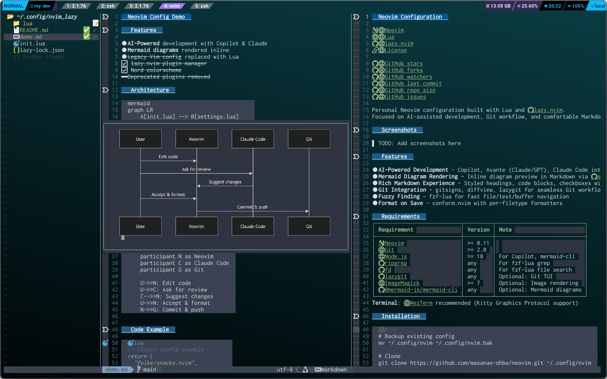

# Neovim Configuration

[](https://neovim.io/)
[](https://www.lua.org/)
[](https://github.com/folke/lazy.nvim)
[](LICENSE)

[](https://github.com/masanao-ohba/neovim/stargazers)
[](https://github.com/masanao-ohba/neovim/network/members)
[](https://github.com/masanao-ohba/neovim/watchers)
[](https://github.com/masanao-ohba/neovim/commits/main)
[](https://github.com/masanao-ohba/neovim)
[](https://github.com/masanao-ohba/neovim/issues)

Personal Neovim configuration built with Lua and [lazy.nvim](https://github.com/folke/lazy.nvim).
Focused on AI-assisted development, Git workflow, and comfortable Markdown editing.

## Screenshots



## Features

- **AI-Powered Development** - Copilot, Avante (Claude/GPT), Claude Code integrations
- **Mermaid Diagram Rendering** - Inline diagram preview in Markdown via [snacks.nvim](https://github.com/folke/snacks.nvim) image module
- **Rich Markdown Experience** - Styled headings, code blocks, checkboxes with [render-markdown.nvim](https://github.com/MeanderingProgrammer/render-markdown.nvim)
- **Git Integration** - gitsigns, diffview, lazygit for seamless Git workflow
- **Fuzzy Finding** - fzf-lua for fast file/text/buffer navigation
- **Format on Save** - conform.nvim with per-filetype formatters

## Requirements

| Requirement | Version | Note |
|-------------|---------|------|
| [Neovim](https://neovim.io/) | >= 0.11 | |
| [Git](https://git-scm.com/) | >= 2.0 | |
| [Node.js](https://nodejs.org/) | >= 18 | For Copilot, mermaid-cli |
| [ripgrep](https://github.com/BurntSushi/ripgrep) | any | For fzf-lua grep |
| [fd](https://github.com/sharkdp/fd) | any | For fzf-lua file search |
| [lazygit](https://github.com/jesseduffield/lazygit) | any | Optional: Git TUI |
| [ImageMagick](https://imagemagick.org/) | >= 7 | Optional: Image rendering |
| [@mermaid-js/mermaid-cli](https://github.com/mermaid-js/mermaid-cli) | any | Optional: Mermaid diagrams |

**Terminal**: [WezTerm](https://wezfurlong.org/wezterm/) recommended (Kitty Graphics Protocol support)

## Installation

```bash
# Backup existing config
mv ~/.config/nvim ~/.config/nvim.bak

# Clone
git clone https://github.com/masanao-ohba/neovim.git ~/.config/nvim

# Launch Neovim (plugins install automatically)
nvim
```

### Optional: Mermaid diagram support

```bash
npm install -g @mermaid-js/mermaid-cli
```

## Directory Structure

```
.
├── init.lua                    # Entry point (leader key, load settings & plugins)
├── lua/
│   ├── config/
│   │   └── lazy.lua            # lazy.nvim bootstrap & plugin imports
│   ├── settings.lua            # Core Vim options, keymaps, colorscheme
│   ├── modules/                # Custom utility modules
│   │   ├── code-block.lua      #   Code block insertion/wrapping
│   │   ├── github-url.lua      #   Copy GitHub URL for current line
│   │   ├── path-info.lua       #   Copy file path + line number
│   │   └── word-replace.lua    #   Interactive word replacement
│   └── plugins/                # Plugin configs (organized by category)
│       ├── ai/                 #   AI integrations (Copilot, Avante, Claude Code)
│       ├── commands/           #   Custom commands (Markdown converter, etc.)
│       ├── completion/         #   nvim-cmp, treesitter
│       ├── devtools/           #   Git tools, terminal, which-key
│       ├── file/               #   fzf-lua, neo-tree, conform, nerdcommenter
│       └── visualize/          #   UI enhancements, Markdown, diagrams
└── lazy-lock.json              # Plugin version lockfile
```

## Plugins (44)

<details>
<summary><strong>AI Integrations (7)</strong></summary>

| Plugin | Description |
|--------|-------------|
| [avante.nvim](https://github.com/yetone/avante.nvim) | AI-powered code editing with Claude/GPT |
| [CopilotChat.nvim](https://github.com/CopilotC-Nvim/CopilotChat.nvim) | Copilot chat interface |
| [copilot.lua](https://github.com/zbirenbaum/copilot.lua) | Inline code suggestions |
| [copilot-cmp](https://github.com/zbirenbaum/copilot-cmp) | Copilot source for nvim-cmp |
| [claude-code.nvim](https://github.com/greggh/claude-code.nvim) | Claude Code terminal integration |
| [claudecode.nvim](https://github.com/coder/claudecode.nvim) | Claude Code WebSocket integration |
| [mcphub.nvim](https://github.com/ravitemer/mcphub.nvim) | MCP server hub |

</details>

<details>
<summary><strong>Completion & Syntax (6)</strong></summary>

| Plugin | Description |
|--------|-------------|
| [nvim-cmp](https://github.com/hrsh7th/nvim-cmp) | Completion engine |
| [cmp-buffer](https://github.com/hrsh7th/cmp-buffer) | Buffer source for nvim-cmp |
| [cmp_luasnip](https://github.com/saadparwaiz1/cmp_luasnip) | LuaSnip source for nvim-cmp |
| [LuaSnip](https://github.com/L3MON4D3/LuaSnip) | Snippet engine |
| [friendly-snippets](https://github.com/rafamadriz/friendly-snippets) | Snippet collection |
| [nvim-treesitter](https://github.com/nvim-treesitter/nvim-treesitter) | Syntax highlighting & parsing |

</details>

<details>
<summary><strong>Development Tools (6)</strong></summary>

| Plugin | Description |
|--------|-------------|
| [gitsigns.nvim](https://github.com/lewis6991/gitsigns.nvim) | Git signs & hunk management |
| [diffview.nvim](https://github.com/sindrets/diffview.nvim) | Side-by-side diff viewer |
| [lazygit.nvim](https://github.com/kdheepak/lazygit.nvim) | LazyGit integration |
| [toggleterm.nvim](https://github.com/akinsho/toggleterm.nvim) | Floating terminal |
| [which-key.nvim](https://github.com/folke/which-key.nvim) | Keybinding helper popup |
| [vim-terraform](https://github.com/hashivim/vim-terraform) | Terraform/HCL support |

</details>

<details>
<summary><strong>File Management (4)</strong></summary>

| Plugin | Description |
|--------|-------------|
| [fzf-lua](https://github.com/ibhagwan/fzf-lua) | Fuzzy finder |
| [neo-tree.nvim](https://github.com/nvim-neo-tree/neo-tree.nvim) | File explorer |
| [conform.nvim](https://github.com/stevearc/conform.nvim) | Format on save |
| [nerdcommenter](https://github.com/preservim/nerdcommenter) | Code commenting |

</details>

<details>
<summary><strong>Visual Enhancements (9)</strong></summary>

| Plugin | Description |
|--------|-------------|
| [snacks.nvim](https://github.com/folke/snacks.nvim) | Image & Mermaid diagram rendering |
| [render-markdown.nvim](https://github.com/MeanderingProgrammer/render-markdown.nvim) | Rich Markdown rendering |
| [lualine.nvim](https://github.com/nvim-lualine/lualine.nvim) | Statusline |
| [noice.nvim](https://github.com/folke/noice.nvim) | UI enhancements |
| [indent-blankline.nvim](https://github.com/lukas-reineke/indent-blankline.nvim) | Indent guides |
| [mini.align](https://github.com/echasnovski/mini.align) | Text alignment |
| [ccc.nvim](https://github.com/uga-rosa/ccc.nvim) | Color picker |
| [nvim-colorizer.lua](https://github.com/norcalli/nvim-colorizer.lua) | Color highlighting |
| [csv.vim](https://github.com/chrisbra/csv.vim) | CSV viewer |

</details>

<details>
<summary><strong>Dependencies & Utilities (12)</strong></summary>

| Plugin | Description |
|--------|-------------|
| [lazy.nvim](https://github.com/folke/lazy.nvim) | Plugin manager |
| [plenary.nvim](https://github.com/nvim-lua/plenary.nvim) | Lua utility library |
| [nui.nvim](https://github.com/MunifTanjim/nui.nvim) | UI component library |
| [nvim-notify](https://github.com/rcarriga/nvim-notify) | Notification manager |
| [nvim-web-devicons](https://github.com/nvim-tree/nvim-web-devicons) | File icons |
| [dressing.nvim](https://github.com/stevearc/dressing.nvim) | Improved UI select/input |
| [fzf](https://github.com/junegunn/fzf) | Fuzzy finder core |
| [fzf.vim](https://github.com/junegunn/fzf.vim) | Fzf Vim integration |
| [nord.nvim](https://github.com/shaunsingh/nord.nvim) | Nord colorscheme |
| [nvcode-color-schemes.vim](https://github.com/ChristianChiarulli/nvcode-color-schemes.vim) | Additional colorschemes |
| [unite.vim](https://github.com/Shougo/unite.vim) | Unite interface |
| [vimproc.vim](https://github.com/Shougo/vimproc.vim) | Async process library |

</details>

## Key Mappings

| Key | Mode | Description |
|-----|------|-------------|
| `Space` | n | Leader key |
| `<C-h>` / `<C-l>` | n | Beginning / End of line |
| `<Esc><Esc>` | n | Clear search highlight |
| `` ` `` | n, v | Code block operations |
| `,vm` | n | Toggle Markdown rendering |
| `,vi` | n | Toggle image/diagram rendering |
| `,vc` | n | Toggle cursor column |
| `,R` | n | Word replace |
| `<C-c>` | n | Copy file path + line number |
| `<Leader>gy` | n | Copy GitHub URL |
| `<Leader>gl` | n | Open LazyGit |
| `<Leader>acc` | n, v | Toggle Claude Code terminal |
| `<C-n>` / `<C-p>` | n | Next / Previous git hunk |
| `F12` | n | Search word under cursor |

## Colorscheme

[Nord](https://github.com/shaunsingh/nord.nvim) with transparent background.

## License

See [LICENSE](LICENSE) for details.
